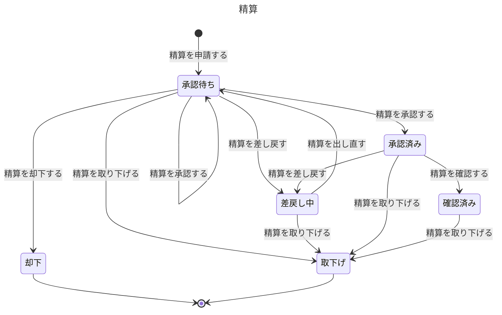

# 経費精算の業務知識

申請者、承認者、経理担当と、後ろでデータモデルを作る人が、立て替えた経費の精算をいつ申請でき、誰がどの順で判断し、いつ支払へ渡せるかを同じ言葉で判断するための業務知識である。経費精算は、申請者が精算を申請したときに始まり、経理担当が精算を確認したとき、または精算が却下か取下げになったときに終わる。確認した精算をいつ払うかは支払の業務が決める。

# 概要

経費精算は、社員が立て替えた業務の経費を、合計金額と承認規程で決まる承認の段に順に通し、経理担当の確認を経て、支払へ渡せる精算にする業務である。紙の運用では、承認者が不在だと精算書が机で止まり、差戻しの理由が残らず、権限を超えた承認がどの規程によるのかを監査に説明できなかった（`input/業務要件.md`「背景と目的」）。この業務は、承認者が不在でも代理承認者が判断でき、差戻しの理由と出し直しで変わったことが残り、どの段で誰が（代理なら誰の代わりに）どの版の規程で判断したかを、後から記録で示せるようにする。

守りたい価値は三つある。立て替えた社員が締めに間に合うよう精算を進められること、承認の権限を持つ人だけが規程の定める順で判断すること、一度した判断を書き換えずに監査と税務調査へ示せることである。

この業務が担わないことと、担う業務は次のとおりである。代理承認者を設定し、取り消すのは代理承認の業務で、この業務は設定された代理を読んで、誰が判断できるかを決める。承認の段を分ける金額、会食費の1人あたりの目安、支出日からの期限、規程の版と施行日は承認規程の業務が決め、この業務はそれを読む。締め、支払対象、支払の確定、給与計算システムへの受け渡しは支払の業務が担う。申請から支払の確定までの経緯を監査のために時系列で見るのは、監査の照会の業務である。誰がどの課と部に属し、誰が課長、部長、担当役員かは人事システムが、領収書の画像とその保存の法令上の要件は文書管理サービスが持ち、この業務はそれを所与として読む。

# ユビキタス言語

業務の言葉と英名の対応は次のとおりである。英名は業務の言葉を英語にした名前で、実装の名前はこれに従う。業務イベントの英名は過去形にする。ほかの業務が決める語は、持ち主の資料がまだ置かれていないため英名を `未定` とし、持ち主の資料ができたら持ち主の英名に替える。役割の語（申請者、承認者、上長、部門長、経理担当、経理部長）をこの資料が持つことと、範囲の外の持ち主へのリンク先は、どちらも仮置きである（「まだ決まっていないこと」を参照）。

| 業務の言葉 | 英名 | 種類 | 持ち主 |
|---|---|---|---|
| 精算 | ExpenseClaim | 業務用語 | この資料 |
| 精算番号 | ExpenseClaimNumber | 業務用語 | この資料 |
| 明細 | ExpenseItem | 業務用語 | この資料 |
| 支出日 | SpentOn | 業務用語 | この資料 |
| 支出の種類 | ExpenseCategory | 業務用語 | この資料 |
| 金額 | Amount | 業務用語 | この資料 |
| 支払先 | Payee | 業務用語 | この資料 |
| 目的 | Purpose | 業務用語 | この資料 |
| 合計金額 | TotalAmount | 業務用語 | この資料 |
| 会食の参加者 | DiningParticipant | 業務用語 | この資料 |
| 目安を超えた理由 | ReasonForExceedingGuideline | 業務用語 | この資料 |
| 申請した日時 | SubmittedAt | 業務用語 | この資料 |
| 承認の段 | ApprovalStep | 業務用語 | この資料 |
| 段に来た日時 | StepReachedAt | 業務用語 | この資料 |
| 承認済みになった日時 | ApprovedAt | 業務用語 | この資料 |
| 判断 | Decision | 業務用語 | この資料 |
| 承認 | Approval | 業務用語 | この資料 |
| 差戻し | SendBack | 業務用語 | この資料 |
| 確認 | Verification | 業務用語 | この資料 |
| 判断の理由 | DecisionReason | 業務用語 | この資料 |
| 申請者 | Claimant | 業務用語 | この資料 |
| 承認者 | Approver | 業務用語 | この資料 |
| 上長 | Supervisor | 業務用語 | この資料 |
| 部門長 | DepartmentHead | 業務用語 | この資料 |
| 経理担当 | AccountingStaff | 業務用語 | この資料 |
| 経理部長 | AccountingDirector | 業務用語 | この資料 |
| 精算を申請した | ExpenseClaimSubmitted | 業務イベント | この資料 |
| 精算を出し直した | ExpenseClaimResubmitted | 業務イベント | この資料 |
| 精算を承認した | ExpenseClaimApproved | 業務イベント | この資料 |
| 精算を差し戻した | ExpenseClaimSentBack | 業務イベント | この資料 |
| 精算を却下した | ExpenseClaimRejected | 業務イベント | この資料 |
| 精算を取り下げた | ExpenseClaimWithdrawn | 業務イベント | この資料 |
| 精算を確認した | ExpenseClaimVerified | 業務イベント | この資料 |
| 承認待ち | AwaitingApproval | 状態 | この資料 |
| 差戻し中 | SentBack | 状態 | この資料 |
| 承認済み | Approved | 状態 | この資料 |
| 確認済み | Verified | 状態 | この資料 |
| 却下 | Rejected | 状態 | この資料 |
| 取下げ | Withdrawn | 状態 | この資料 |
| 精算を申請する | SubmitExpenseClaim | コマンド | この資料 |
| 精算を出し直す | ResubmitExpenseClaim | コマンド | この資料 |
| 精算を承認する | ApproveExpenseClaim | コマンド | この資料 |
| 精算を差し戻す | SendBackExpenseClaim | コマンド | この資料 |
| 精算を却下する | RejectExpenseClaim | コマンド | この資料 |
| 精算を取り下げる | WithdrawExpenseClaim | コマンド | この資料 |
| 精算を確認する | VerifyExpenseClaim | コマンド | この資料 |
| 自分の精算を見る | ListMyExpenseClaims | クエリ | この資料 |
| 承認待ちの精算を見る | ListClaimsAwaitingMyDecision | クエリ | この資料 |
| 確認を待つ精算を見る | ListClaimsAwaitingVerification | クエリ | この資料 |
| 精算の中身を見る | ShowExpenseClaim | クエリ | この資料 |
| 代理承認者 | 未定 | 業務用語 | [代理承認の業務知識](../代理承認/business-knowledge.md) |
| 代理の期間 | 未定 | 業務用語 | [代理承認の業務知識](../代理承認/business-knowledge.md) |
| 承認規程 | 未定 | 業務用語 | [承認規程の業務知識](../承認規程/business-knowledge.md) |
| 規程の版 | 未定 | 業務用語 | [承認規程の業務知識](../承認規程/business-knowledge.md) |
| 施行日 | 未定 | 業務用語 | [承認規程の業務知識](../承認規程/business-knowledge.md) |
| 承認の段を分ける金額 | 未定 | 業務用語 | [承認規程の業務知識](../承認規程/business-knowledge.md) |
| 会食費の1人あたりの目安 | 未定 | 業務用語 | [承認規程の業務知識](../承認規程/business-knowledge.md) |
| 支出日からの期限 | 未定 | 業務用語 | [承認規程の業務知識](../承認規程/business-knowledge.md) |
| 締め | 未定 | 業務用語 | [支払の業務知識](../支払/business-knowledge.md) |
| 支払の予定月 | 未定 | 業務用語 | [支払の業務知識](../支払/business-knowledge.md) |
| 支払を確定した | 未定 | 業務イベント | [支払の業務知識](../支払/business-knowledge.md) |
| 内部監査室の担当者 | 未定 | 業務用語 | [監査の照会の業務知識](../監査の照会/business-knowledge.md) |
| 社員 | 未定 | 業務用語 | 範囲の外: [人事システム（業務の分け方の「検証の外にある持ち主」）](../../split.md) |
| 派遣社員 | 未定 | 業務用語 | 範囲の外: [人事システム（業務の分け方の「検証の外にある持ち主」）](../../split.md) |
| 課 | 未定 | 業務用語 | 範囲の外: [人事システム（業務の分け方の「検証の外にある持ち主」）](../../split.md) |
| 部 | 未定 | 業務用語 | 範囲の外: [人事システム（業務の分け方の「検証の外にある持ち主」）](../../split.md) |
| 課長 | 未定 | 業務用語 | 範囲の外: [人事システム（業務の分け方の「検証の外にある持ち主」）](../../split.md) |
| 部長 | 未定 | 業務用語 | 範囲の外: [人事システム（業務の分け方の「検証の外にある持ち主」）](../../split.md) |
| 担当役員 | 未定 | 業務用語 | 範囲の外: [人事システム（業務の分け方の「検証の外にある持ち主」）](../../split.md) |
| 領収書 | 未定 | 業務用語 | 範囲の外: [文書管理サービス（業務の分け方の「検証の外にある持ち主」）](../../split.md) |

## 業務用語

### 精算

申請者が、立て替えた業務の経費の払い戻しを求めて一回に申請するまとまりである。明細を1件以上30件以下持ち、承認の段を順に通る。紙の運用の「精算書」にあたる。差し戻されて出し直しても同じ精算で、却下された後に同じ支出を別の内容で申請し直したものは新しい精算である。

### 精算番号

精算を一つに特定する番号である。一覧で精算を一件ずつ見せるときは、どの一覧でも精算番号、申請者、合計金額、申請した日時、状態を共通に見せる（共通に見せる項目は仮置き）。

### 明細

精算の中の、一件の支出である。支出日、支出の種類、金額、支払先、目的を書き、領収書を一枚結び付ける。承認と支払の記録は、後から仕訳に使えるよう明細の単位で示せなければならない。明細の位置は、申請者が並べた順に1から数える（位置の表し方は仮置き）。

### 支出日

申請者が経費を支払った日である。支出日からの期限を過ぎたかは、この日と申請した日時の日で判断する。

### 支出の種類

明細の支出が何の経費かの区分で、交通費、宿泊費、会議費、会食費、消耗品費、書籍・資料費、その他の7つのどれか一つである。会食費だけに、会食の参加者と会食費の1人あたりの目安が当たる。

### 金額

明細一件の支出の額で、税込、1円単位の整数である。明細1件あたり1円以上100万円以下とする。

### 支払先

申請者が経費を支払った相手である。

### 目的

その支出が業務のためであることを示す、申請者の説明である。

### 合計金額

精算の明細の金額の合計で、税込である。承認の段の数も、支払う額も、この合計金額で決まる。明細を直して出し直すと変わりうる。

### 会食の参加者

会食費の明細に書く、会食に参加した人の人数と氏名である。社外の人は会社名と氏名を書く。氏名は個人の情報なので、見られる人が限られる（「精算の中身を見る」）。

### 目安を超えた理由

会食費の明細の金額を参加者の人数で割った額が、会食費の1人あたりの目安を超えたときに、申請者が書く理由である。目安を超えても精算は拒まず、この理由を承認者が読んで判断する。

### 申請した日時

申請者が精算の申請を終え、精算が成り立った日時である。書きかけの時点は申請した日時にならない。どの版の規程を当てるかと、支出日からの期限を過ぎたかは、この日時で決まる。出し直した精算でも、最初に申請した日時を使うことを仮置きしている（「まだ決まっていないこと」）。

### 承認の段

精算が承認を受ける一つの順番と、そこで判断する役（上長、部門長、経理部長）の組である。段は上長の段を1として1から数え、前の段の承認が済むまで次の段へ進まない（数え方は仮置き）。経理担当の確認は段ではない。

### 段に来た日時

精算が、ある承認の段で判断を待ち始めた日時である。前の段の承認が成り立った日時か、段1なら申請した日時か出し直した日時になる。承認待ちの精算を見るときの並びに使う（並びは仮置き）。

### 承認済みになった日時

最後の段の承認が成り立った日時である。承認者が判断の操作を始めた時刻ではない。支払の業務は、この日時で締めに間に合ったかを判断する。

### 判断

承認者が自分の段で行う承認、差戻し、却下と、経理担当が行う確認と差戻しをまとめた言葉である。判断には、誰が行ったか、代理なら誰の代わりか、いつ行ったか、判断の理由があるときはその理由が付き、一度記録した判断は書き換えない。

### 承認

承認者が、自分の段の精算を次の段へ進めてよい、または最後の段なら承認済みにしてよいと判断することである。

### 差戻し

直せば通る見込みのある精算を、承認者か経理担当が申請者へ返すことである。差し戻された精算は、申請者が明細を直して出し直せる。

### 確認

経理担当が、承認済みの精算が規程に合っているか、領収書と明細が合っているかを確かめることである。承認ではなく、承認の段に数えない。

### 判断の理由

差戻しと却下のときに、承認者か経理担当が必ず書く理由である。申請者は、この理由を読んで直すか取り下げるかを決める。

### 申請者

業務のために自分のお金で経費を立て替え、その精算を申請する社員である。正社員と契約社員がなれ、派遣社員はなれない。

### 承認者

ある精算の、ある承認の段で判断する人である。段の役に当たる人を、判断する時点の組織の情報で決める（判断の時点で決めることは仮置き）。承認者が自分の精算の承認者にあたるときは、その段を一つ上の役職者が受け持つ。代理の期間中は、代理承認者も本人の段で判断できる。

### 上長

申請者の所属する課の課長である。課に属さない社員（部付きの担当者）の上長は、部門長である。どの精算でも段1の役である。

### 部門長

申請者の所属する部の部長である。合計金額が承認の段を分ける金額の下の値（今の版では5万円）以上の精算で、段2の役になる。

### 経理担当

経理部の担当者で、承認済みの精算を確認し、確認のときに差し戻せる。却下はしない。

### 経理部長

経理部の部長で、合計金額が承認の段を分ける金額の上の値（今の版では30万円）以上の精算と、支出日からの期限を過ぎた明細を含む精算の、最後の段の役になる。

## 業務イベント

### 精算を申請した

申請者が精算の申請を終えた。精算は承認待ちになって段1に来て、承認の段の数と、当てた規程の版が決まる。

### 精算を出し直した

差戻し中の精算を、申請者が明細を直して出し直した。精算は承認待ちに戻り、合計金額と明細から承認の段を決め直す。前の申請の内容と、前に行われた判断は消えずに残る。

### 精算を承認した

承認者が自分の段で精算を承認した。次の段があれば精算はその段で承認待ちのまま進み、最後の段なら承認済みになる。代理承認者が行ったときは、代理した人と本人の両方が残る。

### 精算を差し戻した

承認者が自分の段で、または経理担当が確認のときに、判断の理由を書いて精算を申請者へ返した。精算は差戻し中になる。

### 精算を却下した

承認者が自分の段で、判断の理由を書いて、規程上認められない支出として精算を終わらせた。精算は却下になり、出し直せない。

### 精算を取り下げた

申請者が、支払を確定する前の自分の精算を取り下げた。精算は取下げになり、出し直せない。

### 精算を確認した

経理担当が承認済みの精算を確認した。精算は確認済みになり、支払の業務が支払対象に含めるかを判断できるようになる。

# 概念

## 精算は、段を順に通って承認済みになり、確認で経費精算を離れる

精算は、申請したときに承認の段の並びが決まり、段1から順に承認者の判断を受ける。承認なら次の段へ進み、最後の段の承認で承認済みになる。差戻しなら申請者へ戻り、出し直すと、段1から承認をやり直す（段1からやり直すことは仮置き）。却下なら終わる。承認済みの精算は経理担当が確認し、確認済みになると、いつ払うかは支払の業務が決める。申請者は、支払を確定するまでなら、どの時点でも取り下げられる。

## 承認の段の並びは、合計金額と期限と規程の版で決まる

段の並びは、その精算に当てる規程の版の、承認の段を分ける金額で決まる。今の版では次のとおりである。

| 合計金額（税込） | 承認の段（この順） |
|---|---|
| 5万円未満 | 上長 |
| 5万円以上30万円未満 | 上長、部門長 |
| 30万円以上 | 上長、部門長、経理部長 |

表の区切りの金額は承認規程の値で、改定されれば変わる。区切りの金額ちょうどは上の行に入る（5万円ちょうどは上長と部門長）。支出日からの期限を過ぎた明細を一件でも含む精算は、表の段の最後に経理部長の段を足し、すでに経理部長の段があるときは足さない。

## 判断できるのは、その段の承認者か、代理の期間中の代理承認者だけである

ある段で判断できるのは、その段の役に当たる承認者と、その承認者が代理承認者を設定していて代理の期間中であるときの代理承認者だけである。代理の期間は開始日から終了日までで、終了日を含む。期間が終わると代理承認者は判断できなくなり、判断は本人へ戻る。期間中に代理承認者がした判断は、期間が終わっても取り消さない。代理を立てられるのは上長と部門長だけなので、経理部長の段には代理承認者がいない。代理承認者が本人より低い承認の権限しか持たなくても、本人の段を本人の権限で判断できることを仮置きしている（「まだ決まっていないこと」）。

本人と代理承認者は、代理の期間中どちらも同じ段で判断できる。ただし一つの段で成り立つ判断は一つだけで、先に成り立った判断が通る。

## 自分の精算は、自分では判断しない

承認者が自分の精算の承認者にあたるときは、その段を一つ上の役職者が受け持つ。課長の精算の上長の段は部門長が、部門長の精算の上長の段と部門長の段は担当役員が受け持つ。経理部長の精算の経理部長の段も、同じ決まりで担当役員が受け持つ。こうして同じ人が続く二つの段の承認者になったとき（課長の5万円以上の精算の部門長、部付きの担当者の精算の部門長など）は、段ごとに一度ずつ二度判断することを仮置きしている（「まだ決まっていないこと」）。役員自身の経費は、この業務では扱わない。

代理承認者が自分の精算の段で本人に代わって判断することもできない。その段は本人が判断する。

# 常に守られること

### 精算は、規程の定める承認の段を順にすべて通らなければ承認済みにならない

一つでも段を飛ばして承認済みにすると、権限を超える金額を上長だけで承認した精算が生まれる。昨年の内部監査で見つかったのがこの形で、誰がどの権限で承認したかを説明できなくなる。

### 一つの段で成り立つ判断は、一つだけである

同じ段に承認と差戻しが両方残ると、精算が次へ進んだのか申請者へ戻ったのかを、申請者も次の承認者も判断できない。本人と代理承認者が同時に判断したときにも、この決まりは変わらない。

### 却下と取下げになった精算は、もう変わらない

却下した精算を出し直せると、規程上認められないと判断した支出が、形を変えて同じ精算として通ってしまう。取下げも申請者が自分で終わらせた精算で、同じ支出を払いたければ新しい精算として申請する。

### 支払を確定した精算は、取り下げられない

確定した支払は取り消さないので、確定した後に取り下げを受けると、払う精算と取り下げた精算が同じものになり、経理部は過払いを個別に取り戻すことになる。

### 一度記録した判断と、申請した内容は、書き換えず消さない

誤った判断を正すときも、正したことを新しい判断として記録する。前の判断が書き換わると、監査と税務調査に「その時点で誰が何を見て判断したか」を示せない。

### ある精算について、誰がいつ何を判断し、どの版の規程で段が決まったかを、後から説明できる

監査（内部監査室）と税務調査に、記録で答えるための決まりである。説明するのは、いつ誰が申請したか、どの段で誰が（代理なら誰の代わりに）いつ判断したか、差戻しの判断の理由と、出し直しで明細の何が変わったか、承認の段の数がどの版の規程で決まったかである。判断が起きた順も説明できなければならない。承認した内容は明細の単位で示す。いつどの支払で払われたかは、支払の業務が説明する。

# 状態と、その移り変わり

## 精算は承認待ちから始まり、却下か取下げで終わる



承認待ちから承認待ちへの移り変わりは、次の段がある精算の承認で、精算は次の段で判断を待つ。承認待ちの精算がいまどの段にあるかは、状態とは別に段の番号で表す。確認済みは、経費精算の業務の中では最後の状態である。ただし支払を確定するまでは取り下げられるので、終わりの状態として閉じない。支払を確定した後の精算は、支払の業務が扱う。

状態名は、申請者が自分の精算を言う言葉から仮に置いた（「承認済み」「却下」「取下げ」は要件の語、「承認待ち」「差戻し中」「確認済み」は仮置き）。

# 業務の行い

## コマンド

### 精算を申請する

申請者本人だけが、自分の立て替えた経費を申請できる。他人の分を申請できると、立て替えていない人に払い戻すことになり、誤った支出の責任を誰が負うかが分からなくなる。秘書が役員の分を出すような代理申請は、この業務では扱わない。派遣社員は立て替えを禁じられているので、申請者になれない。

申請できるのは、明細が1件以上30件以下で、どの明細にも支出日、支出の種類、金額、支払先、目的と、領収書が一枚あるときである。金額は明細1件あたり1円以上100万円以下で、100万円ちょうどは申請でき、100万1円は申請できない。30件ちょうどは申請でき、31件は申請できない。会食費の明細には会食の参加者の人数と氏名が要り、金額を人数で割った額が会食費の1人あたりの目安（今の版では5,000円）を超えるときは、目安を超えた理由が要る。目安ちょうどなら理由は要らない。目安を超えても申請は拒まない。

支出日からの期限を過ぎた明細も申請できる。期限は、支出日の3か月後の同じ日（今の版の期限）までで、その翌日から過ぎたことになる（4月10日の支出は7月10日の申請まで期限内、7月11日の申請で期限を過ぎる）。期限を過ぎた明細を含む精算には、経理部長の段が最後に足される。

申請すると「精算を申請した」が起き、精算は承認待ちになって段1に来る。当てる規程の版は申請した日時で決まり、施行日の当日以降に申請した精算には新しい版を、施行日の前日までに申請した精算には前の版を当てる。書きかけの内容は申請ではなく、承認者にも経理担当にも見えない。

#### 拒む理由: 派遣社員が精算を申請する

派遣社員は立て替えを禁じられている。申請を受けると、禁じた立て替えを会社が認めて払い戻すことになる。

#### 拒む理由: 他人の精算を申請する

立て替えていない人に払い戻すことになり、支出の責任を負う人が分からなくなる。

#### 拒む理由: 明細の数が1件以上30件以下でない

明細の無い精算は払い戻す支出が無く、31件以上は一回の精算の上限を超える。

#### 拒む理由: 明細の金額が1円以上100万円以下でない

0円以下の明細は支出ではなく、100万円を超える一件の支出は、立て替えて精算する経費として認めていない。

#### 拒む理由: 明細に書くことが欠けている

支出日、支出の種類、金額、支払先、目的のどれかが無い明細は、承認者と経理担当が規程に合うかを判断できない。

#### 拒む理由: 領収書の無い明細がある

領収書が無いと、経理担当が明細と支出の事実を突き合わせられず、税務調査にも支出を示せない。

#### 拒む理由: 会食の参加者が無い会食費の明細がある

参加者の人数が無ければ1人あたりの額を出せず、氏名が無ければ誰との会食かを監査に示せない。

#### 拒む理由: 会食費の目安を超えた理由が無い

目安を超えた会食は拒まない代わりに、承認者が理由を読んで判断する。理由が無いと、承認者は目安を超えてよい会食かを判断できない。

### 精算を出し直す

申請者本人だけが、自分の差戻し中の精算を出し直せる。他人が直して出し直すと、申請者が申請していない内容で払い戻すことになる。

出し直せるのは、差戻し中の精算だけである。明細を直し、足し、除いてよく、そのときも「精算を申請する」の明細についての拒む理由がすべて同じく当たる。出し直すと「精算を出し直した」が起き、精算は承認待ちになる。どの段から承認し直すかは要件で決まっておらず、段1（上長の段）からやり直すことを仮置きしている。承認の段の並びは、出し直した合計金額と明細で決め直すので、段の数が変わることがある。当てる規程の版と支出日からの期限は、最初に申請した日時で決めることを仮置きしている（どちらも「まだ決まっていないこと」）。前の申請の内容と前の判断は残る。

#### 拒む理由: 差戻し中でない精算を出し直す

却下と取下げになった精算は変わらない。承認待ちや承認済みの精算を出し直せると、承認者が判断した内容と違う内容が、判断を受けないまま通ってしまう。

#### 拒む理由: 他人の精算を出し直す

申請者が申請していない内容で払い戻すことになる。

### 精算を承認する

その精算がいま来ている段の承認者か、代理の期間中のその代理承認者だけが承認できる。ほかの人が承認できると、権限の無い人の承認で精算が進み、段を定めた規程が意味を失う。承認者は、判断する時点の組織の情報で、段の役に当たる人として決まる（判断の時点で決めることは仮置き）。自分の精算の段は、自分では承認できない。

承認できるのは、承認待ちの精算の、いま来ている段だけである。前の段の承認が済むまで、次の段の承認者は承認できない。承認すると「精算を承認した」が起き、次の段があれば精算はその段に来て、無ければ承認済みになる。承認済みになった日時は、最後の段の承認が成り立った日時である。代理承認者が承認したときは、代理した人と本人の両方を残す。

#### 拒む理由: 自分の段が来ていない精算を判断する

前の段の承認が済む前に後の段で判断すると、規程の定める順を飛ばすことになる。承認待ちでない精算（差戻し中、承認済み、確認済み、却下、取下げ）の段で判断することも、この理由で拒む。

#### 拒む理由: その段の承認者でない人が判断する

権限の無い人の判断で精算が進み、段を定めた規程が意味を失う。異動で申請者の上長でなくなった人も、判断する時点ではその段の承認者でない（仮置き）。

#### 拒む理由: 代理の期間の外で代理として判断する

代理の期間が終われば判断は本人へ戻る。期間の外で代理の判断を認めると、本人が知らないうちに本人の段が判断される。

#### 拒む理由: 自分の精算を判断する

自分の立て替えを自分で認めると、承認が支出の歯止めにならない。代理承認者として自分の精算の段で判断することも、この理由で拒む。

### 精算を差し戻す

承認者は自分の段で、経理担当は確認のときに差し戻せる。承認者が差し戻すときには、「精算を承認する」と同じく、自分の段が来ていること、その段の承認者か代理の期間中の代理承認者であること、自分の精算でないことが要る（拒む理由は「精算を承認する」の四つが同じく当たる）。経理担当が差し戻せるのは、承認済みで、まだ確認していない精算だけである。

差し戻すには判断の理由が要る。差し戻すと「精算を差し戻した」が起き、精算は差戻し中になって申請者へ戻る。経理担当は、規程に反する支出を見つけたときも却下せず、差し戻して申請者に取下げを求める。

#### 拒む理由: 判断の理由の無い差戻し

理由が無いと、申請者は何を直せばよいか分からず、監査には何を理由に返したかを示せない。紙の運用で付箋と口頭の差戻しが残らなかった困りごとが、そのまま戻る。

#### 拒む理由: 経理担当が承認済みでない精算を差し戻す

承認の途中の精算は、承認者が判断している最中で、確認の対象ではない。確認済みの精算は、すでに確認を終えている。

### 精算を却下する

自分の段の承認者か、代理の期間中のその代理承認者だけが却下できる。条件と拒む理由は「精算を承認する」の四つが同じく当たる。経理担当は却下しない。

却下するには判断の理由が要る。却下すると「精算を却下した」が起き、精算は却下になって終わる。申請者が同じ支出を別の内容で申請し直すことは妨げないが、それは新しい精算である。

#### 拒む理由: 判断の理由の無い却下

却下した精算は出し直せないので、理由が無ければ申請者は同じ支出をどう申請し直せばよいか分からず、監査にも却下の根拠を示せない。

#### 拒む理由: 経理担当が却下する

確認は承認ではなく、経理担当に精算を終わらせる判断は無い。経理担当が規程に反すると判断したことは、差戻しで申請者へ返す。

### 精算を取り下げる

申請者本人だけが、自分の精算を取り下げられる。他人が取り下げられると、申請者の知らないうちに払い戻しが止まる。

取り下げられるのは、承認待ち、差戻し中、承認済み、確認済みのどれかで、まだ支払を確定していない精算である。取り下げると「精算を取り下げた」が起き、精算は取下げになって、出し直せない。

#### 拒む理由: 他人の精算を取り下げる

申請者の知らないうちに払い戻しが止まる。

#### 拒む理由: 支払を確定した精算を取り下げる

確定した支払は取り消さないので、取り下げた精算に払うことになる。確定した後に誤りが見つかったときの扱いは、この業務の行いではない（「まだ決まっていないこと」）。この理由の元になる「支払を確定した」は支払の業務の事実である。

#### 拒む理由: 却下か取下げになった精算を取り下げる

却下と取下げになった精算は、もう変わらない。

### 精算を確認する

経理担当だけが確認できる。確認は、規程に合うか、領収書と明細が合うかを経理部の責任で確かめることで、ほかの人の確認では支払へ渡す根拠にならない。

確認できるのは、承認済みの精算だけである。確認すると「精算を確認した」が起き、精算は確認済みになる。どの月の支払対象に含めるかは、承認済みになった日時と締めから、支払の業務が決める。

#### 拒む理由: 経理担当でない人が確認する

経理部の責任で確かめたことにならず、支払へ渡す根拠にならない。

#### 拒む理由: 承認済みでない精算を確認する

すべての段の承認を通っていない精算を確認すると、承認を飛ばして支払へ渡すことになる。

## クエリ

### 自分の精算を見る

申請者本人だけが、自分の精算を見られる。ほかの人の精算は表示対象に入らない。

見せるのは、その申請者が申請したすべての精算である。一件ごとに、共通の項目（精算番号、申請者、合計金額、申請した日時、状態）に加えて、承認待ちならいまの段の番号と役、その段で判断を待たれている承認者（代理の期間中なら代理承認者も）、差戻し中と却下なら判断の理由、確認済みなら支払の予定月を見せる。支払の予定月は支払の業務が決める。並び順は業務の判断を変えないので、API の契約に置いた。一度に返す件数と続きの位置も、API の契約に置いた（仮置き）。

### 承認待ちの精算を見る

承認者と代理承認者が、自分が判断を待たれている精算を見られる。ほかの人の承認待ちは表示対象に入らない。

表示対象は、承認待ちの精算のうち、いま来ている段の承認者が自分であるものと、自分が代理承認者で代理の期間中の本人の段に来ているものである。自分が申請者の精算は、代理承認者として見る場合も含めない。一件ごとに、共通の項目に加えて、段の番号と役、段に来た日時、代理として見ているなら本人の名前を見せる。段に来た日時の古い順に並べ、同じ日時なら申請した日時の古い順にすることを仮置きしている（「まだ決まっていないこと」）。締めの当日には一人に100件を超えて積み上がるが、一度に返す件数は品質要求（`input/非機能要件.md`）と API の契約に置いた。

### 確認を待つ精算を見る

経理担当だけが見られる。

表示対象は、承認済みで、まだ確認しておらず、取下げになっていない精算である。一件ごとに、共通の項目に加えて承認済みになった日時を見せる。並び順は業務の判断を変えないので、API の契約に置いた。どの精算をどの月に支払うかは、支払の業務の支払対象の一覧が決める。

### 精算の中身を見る

その精算の申請者、その精算の段で判断を待たれているか判断した承認者（代理承認者と、代理された本人を含む）、経理担当が見られる。ほかの社員に見せると、会食の参加者の氏名や立て替えの内容が漏れる。内部監査室の担当者は、監査の照会の業務で経緯を見る。部門長が自分の部の社員の精算を段にかかわらず見られるかは決まっておらず、見られないことを仮置きしている（「まだ決まっていないこと」）。

見せるのは、明細（申請者が並べた順）、会食の参加者、合計金額、承認の段の並びと、当てた規程の版、これまでの判断の経緯である。判断の経緯は起きた順に並べ、誰が（代理なら誰の代わりに）、いつ、どの段で、どう判断したか、判断の理由と、出し直しの前後の明細を見せる。本人は、代理承認者が自分の段でした判断をここで見られる。

#### 拒む理由: 関係の無い人が精算の中身を見る

会食の参加者の氏名は個人の情報で、立て替えの内容も申請者のものである。関係の無い社員に見せると、承認に要らない人へ個人の情報が漏れる。

# 導出されること

合計金額は、明細の金額の合計である。承認の段の並びは、合計金額をその精算に当てる規程の版の承認の段を分ける金額に照らして決まり、支出日からの期限を過ぎた明細が一件でもあれば、最後に経理部長の段を足す（すでにあれば足さない）。支出日からの期限を過ぎたかは、支出日の3か月後の同じ日と申請した日時の日を比べて決まる。会食費の1人あたりの額は、会食費の明細の金額を参加者の人数で割って決まる。各段の承認者は、段の役（上長、部門長、経理部長）を判断する時点の組織の情報に当て、自分の精算の承認者にあたるなら一つ上の役職者に替えて決まる。

# 同時に起きたとき

### 同時に起きること: 同じ精算に取下げと承認が届く

先に成り立った方だけが通る。取下げが先なら精算は取下げになり、承認は成り立たず、判断の記録も残らない。承認が先なら、承認が残ったうえで、取下げは承認後の状態に対して改めて判断される。どちらの場合も、通らなかった側には精算の状態がすでに変わったことを伝える。一つの段で成り立つ判断は一つだけだからである（BDD-070、BDD-071）。

### 同時に起きること: 本人と代理承認者が同じ段で判断する

先に成り立った判断だけが通る。後の判断は成り立たず、記録に残らない。二つの判断が両方残ると、精算が進んだのか戻ったのかが分からなくなるからである（BDD-072）。

### 同時に起きること: 支払の確定と取下げが同じ精算に届く

先に成り立った方だけが通る。支払の確定が先なら取下げは成り立たず、取下げが先なら精算は取下げになる。取下げになった精算を支払の確定に含めないことは、支払の業務の決まりである。確定した支払は取り消さないからである（BDD-073、BDD-074）。

# まだ決まっていないこと

### 出し直した精算を、どの段から承認し直すか（仮置き）

段1（上長の段）からやり直すことを仮に置いた。根拠は、出し直しで明細と合計金額が変わると段の数も変わり、前に承認した承認者は変わった内容を見ていないことである。最初からやり直せば、承認した内容と払う内容を一致させて監査に示せる。採らなかった案は、差し戻した段からやり直す案（営業部門の意見）である。要件は経理部と営業部門の意見が分かれていると書き、この資料は優先を決めていない。決めるのは経理部と営業部門の代表者の合意である（`input/業務要件.md`「承認者は承認、差戻し、却下のどれかを選ぶ」、grill Q1）。BDD-041、BDD-042 はこの仮置きによる。

### 出し直した精算に、どの時点の規程の版と支出日からの期限を当てるか（仮置き）

最初に申請した日時で決めることを仮に置いた。根拠は、要件が規程の版を「精算」の申請で決めていることと、差戻しにかかった時間の分だけ申請者に期限切れや規程の変更が及ぶと、承認の遅れを申請者が負うことである。採らなかった案は、出し直した日時で決める案で、出し直しで足した明細にも最初の申請の日で期限を数えてしまう弱点を避けられる。決めるのは経理部長（承認規程の持ち主）である（`input/業務要件.md`「承認規程の改定」、grill Q2）。BDD-043 はこの仮置きによる。

### 同じ人が続く二つの段の承認者にあたるとき、二度判断するか（仮置き）

段ごとに一度ずつ、二度判断することを仮に置いた。根拠は、段の数は規程の版で決まり、監査は段ごとに誰が判断したかを問うので、判断の無い段を作らないためである。採らなかった案は、一度で二つの段を済ませる案である。決めるのは経理部である（`input/業務要件.md`「自分の申請は自分で承認しない」、grill Q3）。BDD-025 はこの仮置きによる。

### 本人より低い権限の代理承認者が、本人の段を判断できるか（仮置き）

判断できることを仮に置いた。根拠は、代理を立てる目的が不在の承認者の机で精算を止めないことにあり、代理承認者は本人が選んだ同じ部の課長以上で、判断は代理した人と本人の両方で残ることである。採らなかった案は、代理承認者の役職で承認できる金額までに限る案で、超える精算は本人の復帰を待つ。紙の運用では押印した例もしなかった例もある。決めるのは経理部である（`input/業務要件.md`「不在の承認者は代理を立てられる」、grill Q4）。BDD-031 はこの仮置きによる。

### 人事異動で上長が変わったとき、承認待ちの精算を誰が判断するか（仮置き）

判断する時点の組織の情報で承認者を決め、異動の後は新しい上長が判断することを仮に置いた。根拠は、上長が「申請者の所属する課の課長」と定義され、異動した元の課長はもう上長ではないことである。採らなかった案は、申請した時点の上長に固定する案で、紙の運用では異動前の上長が判断してから引き継ぐことが多かった。決めるのは経理部である（`input/非機能要件.md`「外部のシステムとのつなぎ」、`input/利用規模と運用.md`「規程と組織の変わり方」、grill Q5）。BDD-032 はこの仮置きによる。

### 承認待ちの精算をどの順で並べるか（仮置き）

段に来た日時の古い順、同じなら申請した日時の古い順に並べることを仮に置いた。根拠は、要件の要望が「待っている時間が長いものから」であり、承認者の段で止まっている精算を先に判断できることである。採らなかった案は、申請した日時の古い順に並べる案である。要件では要望で、決定ではない。決めるのは経理部と各部門の代表者である（`input/業務要件.md`「見るための機能」、grill Q6）。BDD-081 はこの仮置きによる。

### 部門長が、自分の部の社員の精算を段にかかわらず見られるか（仮置き）

初期リリースでは見られないことを仮に置いた。根拠は、要件が「申請者と承認者が見られるのは、自分に関係する申請だけ」を決まりとして書いていることである。採らなかった案は、部門長に自分の部の精算をすべて見せる案（部門長の要望）である。決めるのは初期リリースの範囲を決める会議である（`input/業務要件.md`「見るための機能」、grill の上限を超えた論点 U1）。BDD-086 はこの仮置きによる。

### 支出日の3か月後に同じ日が無いとき、いつまでを期限内とするか（仮置き）

3か月後の月の末日までを期限内とすることを仮に置いた（11月30日の支出は2月の末日まで）。根拠は、要件が同じ日がある場合の例だけを書き、「3か月後の同じ日まで」の意図に最も近いのが月の末日であることである。採らなかった案は、翌月の初日までとする案である。決めるのは経理部長（承認規程の持ち主）である（grill の上限を超えた論点 U2）。

### 支払を確定した後に誤りが見つかったときの「精算の訂正」を扱うか

答えを置いていない。初期リリースの範囲を決める会議で結論が出ておらず、初期リリースの「扱う」にも無い（`input/業務要件.md`「支払確定の後に誤りが見つかったとき」）。扱うと決まれば、それが経費精算の行いか、分け方の一覧に無い別の業務かを依頼元が決める必要がある。決めるのは初期リリースの範囲を決める会議である。

### 役割の語の持ち主（仮置き）

申請者、承認者、上長、部門長、経理担当、経理部長をこの資料が持ち、内部監査室の担当者を監査の照会の業務が持つことを仮に置いた。根拠は、業務の分け方の一覧に役割の語の持ち主が無く、上長と部門長は申請者に対する承認の役として経費精算で意味が決まることである。採らなかった案は、役割の語だけを持つ別の資料を立てる案である。決めるのは依頼元（業務の分け方の一覧の持ち主）である。

### 範囲の外の持ち主の資料の置き場（仮置き）

人事システムと文書管理サービスの語の持ち主の欄は、持ち主を宣言している業務の分け方（`split.md`）の「検証の外にある持ち主」へのリンクとし、英名を `未定` にすることを仮に置いた。根拠は、各システムの資料の置き場が渡されていないことである。採らなかった案は、要件の文書をリンク先にする案で、要件は持ち主を宣言していない。決めるのは依頼元である。

### 一件ごとに見せる共通の項目、段と明細の位置の表し方、一覧の続きの位置（仮置き）

一件の精算を一覧に見せるときの共通の項目を、精算番号、申請者、合計金額、申請した日時、状態とすることを仮に置いた。段は上長の段を1として1から数え、経理担当の確認は段に数えず、明細は申請者が並べた順に1から数える。一覧の続きの位置は業務の判断を変えないので、API の契約に置く。根拠は、業務の分け方の一覧に答えが無く、支払と監査の照会も精算を一件ずつ並べるので、共通の形が要ることである。採らなかった案は、一覧ごとに項目と数え方を決める案である。業務の分け方の一覧は「最初に置かれた資料の答えに合わせる」と書くが、先に書いた資料の答えが広がるのを避けるため、この資料の答えは依頼元が決めるまでの仮置きにとどめる。決めるのは依頼元である。

# BDD

ここまでの決まりが、具体の場面でどう働くかを示す。**ここに上で書いていない決まりを持ち込まない。** 金額の区切り（5万円、30万円）、会食費の目安（5,000円）、支出日からの期限（3か月）は、今の版の規程の値で示す。

## 精算を申請する

### [BDD-001] 4万円の精算を申請すると、上長の段だけで承認待ちになる

```gherkin
Given: 社員 E-101 は営業一課に属する正社員で、営業一課の課長は E-201 である
  And: 明細は1件で、支出日2026年9月20日、交通費、金額40,000円、支払先と目的があり、領収書が一枚結び付いている
When: E-101 が2026年9月25日 10:00に精算を申請する
Then: 精算 C-0001 が承認待ちで生まれ、合計金額は40,000円である
  And: 承認の段は段1の上長（E-201）だけで、精算は段1に来ている
  And: 「精算を申請した」が起きる
```

### [BDD-002] 合計金額が49,999円の精算は、上長の段だけになる

```gherkin
Given: 社員 E-101 の上長は E-201 で、部門長は E-301 である
  And: 明細は2件で、金額は30,000円と19,999円、どちらも支出日から3か月以内である
When: E-101 が2026年9月25日に精算を申請する
Then: 合計金額は49,999円で、承認の段は段1の上長だけである
```

### [BDD-003] 合計金額が50,000円ちょうどの精算は、上長と部門長の段になる

```gherkin
Given: 社員 E-101 の上長は E-201 で、部門長は E-301 である
  And: 明細は2件で、金額は30,000円と20,000円、どちらも支出日から3か月以内である
When: E-101 が2026年9月25日に精算を申請する
Then: 合計金額は50,000円で、承認の段は段1の上長（E-201）、段2の部門長（E-301）である
```

### [BDD-004] 合計金額が300,000円ちょうどの精算は、経理部長の段まで通る

```gherkin
Given: 社員 E-101 の上長は E-201、部門長は E-301、経理部長は E-401 である
  And: 明細は1件で、宿泊費、金額300,000円、支出日から3か月以内である
When: E-101 が2026年9月25日に精算を申請する
Then: 承認の段は段1の上長、段2の部門長、段3の経理部長である
```

### [BDD-005] 支出日の3か月後の同じ日に申請した明細は、期限内である

```gherkin
Given: 明細は1件で、支出日2026年4月10日、金額8,000円である
When: 社員 E-101 が2026年7月10日に精算を申請する
Then: 明細は支出日からの期限内で、承認の段は段1の上長だけである
```

### [BDD-006] 支出日の3か月後の翌日に申請した明細を含むと、最後に経理部長の段が足される

```gherkin
Given: 明細は1件で、支出日2026年4月10日、金額8,000円である
When: 社員 E-101 が2026年7月11日に精算を申請する
Then: 精算は承認待ちで生まれる
  And: 承認の段は段1の上長、段2の経理部長である
```

### [BDD-007] 経理部長の段がある精算は、期限を過ぎた明細があっても経理部長の段を足さない

```gherkin
Given: 明細は2件で、一件は支出日2026年4月10日の金額10,000円、もう一件は支出日2026年7月1日の金額300,000円である
When: 社員 E-101 が2026年7月20日に精算を申請する
Then: 承認の段は段1の上長、段2の部門長、段3の経理部長で、経理部長の段は一つだけである
```

### [BDD-008] 会食費が1人あたり5,000円ちょうどなら、目安を超えた理由は要らない

```gherkin
Given: 明細は1件で、会食費、金額10,000円、参加者は社員 E-101 と社外の A社 山田氏の2人で、目安を超えた理由は書いていない
When: 社員 E-101 が2026年9月25日に精算を申請する
Then: 精算は承認待ちで生まれる
```

### [BDD-009] 会食費が目安を超えても、理由があれば申請できる

```gherkin
Given: 明細は1件で、会食費、金額15,000円、参加者は2人で人数と氏名がある
  And: 目安を超えた理由に「先方の指定した会場のため」と書いている
When: 社員 E-101 が2026年9月25日に精算を申請する
Then: 精算は承認待ちで生まれ、1人あたりの額は7,500円で、承認者は目安を超えた理由を読んで判断する
```

### [BDD-010] 会食費が目安を超えて理由が無いと、申請できない

```gherkin
Given: 明細は1件で、会食費、金額15,000円、参加者は2人で人数と氏名がある
  And: 目安を超えた理由は書いていない
When: 社員 E-101 が2026年9月25日に精算を申請する
Then: 精算は生まれない
  NOTE: Rule: 会食費の目安を超えた理由が無い
    Reason: 承認者は目安を超えてよい会食かを判断できない
```

### [BDD-011] 参加者の無い会食費の明細は、申請できない

```gherkin
Given: 明細は1件で、会食費、金額8,000円で、参加者の人数と氏名が無い
When: 社員 E-101 が2026年9月25日に精算を申請する
Then: 精算は生まれない
  NOTE: Rule: 会食の参加者が無い会食費の明細がある
    Reason: 1人あたりの額も、誰との会食かも示せない
```

### [BDD-012] 明細が30件ちょうどなら申請でき、31件なら申請できない

```gherkin
Given: 社員 E-101 は、交通費の明細を31件並べ、どの明細にも書くことと領収書がそろっている
When: E-101 が2026年9月25日に精算を申請する
Then: 精算は生まれない
  And: 明細を30件にすれば申請できる
  NOTE: Rule: 明細の数が1件以上30件以下でない
    Reason: 31件は一回の精算の上限を超える
```

### [BDD-013] 金額が100万1円の明細は、申請できない

```gherkin
Given: 明細は1件で、宿泊費、金額1,000,001円である
When: 社員 E-101 が2026年9月25日に精算を申請する
Then: 精算は生まれない
  NOTE: Rule: 明細の金額が1円以上100万円以下でない
    Reason: 100万円を超える一件の支出は、立て替えて精算する経費として認めていない
```

### [BDD-014] 領収書の無い明細があると、申請できない

```gherkin
Given: 明細は2件で、1件目には領収書が結び付き、2件目には領収書が無い
When: 社員 E-101 が2026年9月25日に精算を申請する
Then: 精算は生まれない
  NOTE: Rule: 領収書の無い明細がある
    Reason: 明細と支出の事実を突き合わせられない
```

### [BDD-015] 支払先の無い明細があると、申請できない

```gherkin
Given: 明細は1件で、支出日、支出の種類、金額、目的と領収書はあるが、支払先が無い
When: 社員 E-101 が2026年9月25日に精算を申請する
Then: 精算は生まれない
  NOTE: Rule: 明細に書くことが欠けている
    Reason: 承認者と経理担当が規程に合うかを判断できない
```

### [BDD-016] 派遣社員は精算を申請できない

```gherkin
Given: 社員 E-901 は派遣社員である
  And: 明細は1件で、書くことと領収書がそろっている
When: E-901 が2026年9月25日に精算を申請する
Then: 精算は生まれない
  NOTE: Rule: 派遣社員が精算を申請する
    Reason: 派遣社員は立て替えを禁じられている
```

### [BDD-017] 他人の立て替えを自分の名前で申請できない

```gherkin
Given: 社員 E-102 が立て替えた経費の明細がある
When: 社員 E-101 が申請者を E-102 として精算を申請する
Then: 精算は生まれない
  NOTE: Rule: 他人の精算を申請する
    Reason: 立て替えていない人に払い戻すことになる
```

### [BDD-018] 施行日の前日に申請した精算には前の版を、施行日に申請した精算には新しい版を当てる

```gherkin
Given: 承認規程の版1は部門長の段を足す金額を50,000円とし、版2は施行日2026年11月1日で、この金額を100,000円とする（版2の値は例）
  And: 社員 E-101 の精算 C-0010 と C-0011 は、どちらも合計金額70,000円である
When: E-101 が C-0010 を2026年10月31日 23:50に、C-0011 を2026年11月1日 09:00に申請する
Then: C-0010 には版1を当て、承認の段は上長と部門長である
  And: C-0011 には版2を当て、承認の段は上長だけである
  And: どちらの精算にも、当てた規程の版が残る
```

## 精算を承認する

### [BDD-020] 上長の段だけの精算を上長が承認すると、承認済みになる

```gherkin
Given: 精算 C-0001 は合計金額40,000円、承認の段は段1の上長（E-201）だけで、承認待ちで段1に来ている
When: E-201 が2026年9月26日 11:00に C-0001 を承認する
Then: C-0001 は承認済みになり、承認済みになった日時は2026年9月26日 11:00である
  And: 「精算を承認した」が起き、段1を E-201 が承認したことが残る
```

### [BDD-021] 部門長の段がある精算を上長が承認すると、部門長の段に進む

```gherkin
Given: 精算 C-0002 は合計金額60,000円、承認の段は段1の上長（E-201）、段2の部門長（E-301）で、承認待ちで段1に来ている
When: E-201 が2026年9月26日 11:00に C-0002 を承認する
Then: C-0002 は承認待ちのまま段2に来て、段に来た日時は2026年9月26日 11:00である
```

### [BDD-022] 上長が承認する前に、部門長は承認できない

```gherkin
Given: 精算 C-0002 は承認待ちで段1（上長 E-201）に来ている
When: 部門長 E-301 が C-0002 を承認する
Then: C-0002 は段1で承認待ちのまま変わらない
  NOTE: Rule: 自分の段が来ていない精算を判断する
    Reason: 前の段の承認が済む前に後の段で判断すると、規程の定める順を飛ばす
```

### [BDD-023] 申請者の上長でない課長は承認できない

```gherkin
Given: 精算 C-0001 の申請者 E-101 は営業一課に属し、上長は E-201 である
  And: E-202 は営業二課の課長である
When: E-202 が段1で C-0001 を承認する
Then: C-0001 は承認待ちのまま変わらない
  NOTE: Rule: その段の承認者でない人が判断する
    Reason: 権限の無い人の判断で精算が進む
```

### [BDD-024] 課長の精算の上長の段は、部門長が承認する

```gherkin
Given: 課長 E-201 が合計金額30,000円の精算 C-0003 を申請し、E-201 の部の部長は E-301 である
When: C-0003 の承認の段が決まる
Then: 段1の承認者は E-301 で、E-201 は C-0003 のどの段でも判断できない
```

### [BDD-025] 課長の5万円以上の精算は、部門長が上長の段と部門長の段で二度承認する（仮置き）

```gherkin
Given: 課長 E-201 の精算 C-0004 は合計金額60,000円で、段1の承認者も段2の承認者も部門長 E-301 である
  And: C-0004 は承認待ちで段1に来ている
When: E-301 が2026年9月26日 10:00に段1で C-0004 を承認する
Then: C-0004 は承認待ちのまま段2に来て、段2の承認者は E-301 である
  And: E-301 が段2で改めて承認すると、C-0004 は承認済みになる
```

### [BDD-026] 部門長の精算の上長の段は、担当役員が承認する

```gherkin
Given: 部門長 E-301 が合計金額20,000円の精算 C-0005 を申請し、E-301 の担当役員は E-501 である
When: E-501 が2026年9月26日に段1で C-0005 を承認する
Then: C-0005 は承認済みになる
```

### [BDD-027] 代理の期間中の代理承認者が承認すると、代理した人と本人の両方が残る

```gherkin
Given: 精算 C-0006 は承認待ちで段2（部門長 E-301）に来ている
  And: E-301 は代理承認者を部長 E-302 とし、代理の期間を2026年9月24日から2026年9月30日までと設定している
When: E-302 が2026年9月26日 14:00に段2で C-0006 を承認する
Then: C-0006 は承認済みになる
  And: 段2を E-302 が E-301 の代わりに承認したことが残る
```

### [BDD-028] 代理の期間の終了日には、代理承認者が判断できる

```gherkin
Given: 精算 C-0006 は承認待ちで段2（部門長 E-301）に来ている
  And: E-301 の代理承認者は E-302 で、代理の期間は2026年9月24日から2026年9月30日までである
When: E-302 が2026年9月30日 23:50に段2で C-0006 を承認する
Then: C-0006 は承認済みになる
```

### [BDD-029] 代理の期間が終わった翌日には、代理承認者は判断できない

```gherkin
Given: 精算 C-0007 は承認待ちで段2（部門長 E-301）に来ている
  And: E-301 の代理承認者は E-302 で、代理の期間は2026年9月24日から2026年9月30日までである
When: E-302 が2026年10月1日 09:00に段2で C-0007 を承認する
Then: C-0007 は承認待ちのまま変わらず、E-301 が判断できる
  NOTE: Rule: 代理の期間の外で代理として判断する
    Reason: 代理の期間が終われば判断は本人へ戻る
```

### [BDD-030] 代理承認者は、自分の精算を代理で承認できない

```gherkin
Given: 課長 E-203 は部門長 E-301 の代理承認者で、代理の期間は2026年9月24日から2026年9月30日までである
  And: E-203 の精算 C-0008 は承認待ちで段2（部門長 E-301）に来ている
When: E-203 が2026年9月26日に段2で C-0008 を E-301 の代わりに承認する
Then: C-0008 は承認待ちのまま変わらず、段2は E-301 が判断する
  NOTE: Rule: 自分の精算を判断する
    Reason: 自分の立て替えを自分で認めると、承認が支出の歯止めにならない
```

### [BDD-031] 課長の代理承認者が、部門長の段を部門長の権限で承認できる（仮置き）

```gherkin
Given: 部門長 E-301 は代理承認者を同じ部の課長 E-203 とし、代理の期間を2026年9月24日から2026年9月30日までと設定している
  And: 精算 C-0009 は合計金額120,000円で、承認待ちで段2（部門長 E-301）に来ている
When: E-203 が2026年9月26日に段2で C-0009 を承認する
Then: C-0009 は承認済みになる
  And: 段2を E-203 が E-301 の代わりに承認したことが残る
```

### [BDD-032] 異動の後は新しい上長が判断し、元の上長は判断できない（仮置き）

```gherkin
Given: 精算 C-0012 の申請者 E-101 は営業一課に属し、C-0012 は承認待ちで段1に来ている
  And: 2026年10月1日の異動で、営業一課の課長は E-201 から E-204 に替わった
When: E-201 が2026年10月1日 10:00に段1で C-0012 を承認する
Then: C-0012 は承認待ちのまま変わらず、段1は E-204 が判断する
  NOTE: Rule: その段の承認者でない人が判断する
    Reason: 判断する時点で E-201 は E-101 の上長でない
```

### [BDD-033] 承認済みになった日時は、承認が成り立った日時である

```gherkin
Given: 精算 C-0013 は承認待ちで、最後の段1（上長 E-201）に来ている
  And: E-201 は2026年9月30日 16:59に C-0013 の判断を始めた
When: E-201 の承認が2026年9月30日 17:00:20に成り立つ
Then: C-0013 は承認済みになり、承認済みになった日時は2026年9月30日 17:00:20である
```

## 精算を差し戻す

### [BDD-034] 上長が理由を書いて差し戻すと、差戻し中になる

```gherkin
Given: 精算 C-0002 は承認待ちで段1（上長 E-201）に来ている
When: E-201 が2026年9月26日に、判断の理由「3件目の明細の目的が書かれていない」を書いて C-0002 を差し戻す
Then: C-0002 は差戻し中になり、申請者 E-101 へ戻る
  And: 段1を E-201 が差し戻したことと、判断の理由が残る
```

### [BDD-035] 理由の無い差戻しはできない

```gherkin
Given: 精算 C-0002 は承認待ちで段1（上長 E-201）に来ている
When: E-201 が判断の理由を書かずに C-0002 を差し戻す
Then: C-0002 は承認待ちのまま変わらない
  NOTE: Rule: 判断の理由の無い差戻し
    Reason: 申請者は何を直せばよいか分からず、監査に理由を示せない
```

### [BDD-036] 経理担当が、承認済みの精算を理由を書いて差し戻せる

```gherkin
Given: 精算 C-0001 は承認済みで、まだ確認していない
When: 経理担当 E-601 が2026年10月2日に、判断の理由「領収書の金額と明細の金額が違う」を書いて C-0001 を差し戻す
Then: C-0001 は差戻し中になり、申請者 E-101 へ戻る
```

### [BDD-037] 経理担当は、承認の途中の精算を差し戻せない

```gherkin
Given: 精算 C-0002 は承認待ちで段2（部門長 E-301）に来ている
When: 経理担当 E-601 が判断の理由を書いて C-0002 を差し戻す
Then: C-0002 は承認待ちのまま変わらない
  NOTE: Rule: 経理担当が承認済みでない精算を差し戻す
    Reason: 承認の途中の精算は確認の対象ではない
```

## 精算を出し直す

### [BDD-041] 差し戻された精算を出し直すと、上長の段から承認し直す（仮置き）

```gherkin
Given: 精算 C-0002 は合計金額60,000円で、段1を上長 E-201 が承認し、段2で部門長 E-301 が差し戻して差戻し中である
When: 申請者 E-101 が2026年9月28日に明細の目的を直して C-0002 を出し直す
Then: C-0002 は承認待ちになり、段1（上長 E-201）に来る
  And: 「精算を出し直した」が起き、前の申請の内容と、E-201 の承認、E-301 の差戻しと判断の理由は残る
```

### [BDD-042] 出し直しで合計金額が5万円以上になると、部門長の段が加わる（仮置き）

```gherkin
Given: 精算 C-0014 は合計金額45,000円で、承認の段は上長だけで、上長が差し戻して差戻し中である
When: 申請者 E-101 が2026年9月28日に明細を1件足し、合計金額60,000円にして C-0014 を出し直す
Then: C-0014 は承認待ちで段1に来て、承認の段は段1の上長、段2の部門長になる
```

### [BDD-043] 施行日をまたいで出し直しても、最初に申請した日時の版を当てる（仮置き）

```gherkin
Given: 承認規程の版2の施行日は2026年11月1日である
  And: 精算 C-0015 は2026年10月28日に申請されて版1を当てられ、差戻し中である
When: 申請者 E-101 が2026年11月2日に C-0015 を出し直す
Then: C-0015 には版1を当て、承認の段は版1の金額で決め直す
```

### [BDD-044] 却下になった精算は出し直せない

```gherkin
Given: 精算 C-0016 は却下である
When: 申請者 E-101 が C-0016 の明細を直して出し直す
Then: C-0016 は却下のまま変わらない
  NOTE: Rule: 差戻し中でない精算を出し直す
    Reason: 却下と取下げになった精算は変わらない
```

### [BDD-045] 他人の差し戻された精算は出し直せない

```gherkin
Given: 社員 E-102 の精算 C-0017 は差戻し中である
When: 社員 E-101 が C-0017 を出し直す
Then: C-0017 は差戻し中のまま変わらない
  NOTE: Rule: 他人の精算を出し直す
    Reason: 申請者が申請していない内容で払い戻すことになる
```

## 精算を却下する

### [BDD-050] 部門長が理由を書いて却下すると、精算は却下で終わる

```gherkin
Given: 精算 C-0018 は承認待ちで段2（部門長 E-301）に来ている
When: E-301 が2026年9月26日に、判断の理由「私的な会食で業務の支出ではない」を書いて C-0018 を却下する
Then: C-0018 は却下になり、出し直せない
  And: 段2を E-301 が却下したことと、判断の理由が残る
```

### [BDD-051] 理由の無い却下はできない

```gherkin
Given: 精算 C-0018 は承認待ちで段2（部門長 E-301）に来ている
When: E-301 が判断の理由を書かずに C-0018 を却下する
Then: C-0018 は承認待ちのまま変わらない
  NOTE: Rule: 判断の理由の無い却下
    Reason: 申請者は同じ支出をどう申請し直せばよいか分からず、監査に却下の根拠を示せない
```

### [BDD-052] 経理担当は却下できない

```gherkin
Given: 精算 C-0001 は承認済みで、まだ確認していない
When: 経理担当 E-601 が判断の理由を書いて C-0001 を却下する
Then: C-0001 は承認済みのまま変わらない
  NOTE: Rule: 経理担当が却下する
    Reason: 確認は承認ではなく、経理担当に精算を終わらせる判断は無い
```

## 精算を取り下げる

### [BDD-055] 承認待ちの精算を取り下げると、取下げで終わる

```gherkin
Given: 申請者 E-101 の精算 C-0002 は承認待ちで段2に来ている
When: E-101 が2026年9月27日に C-0002 を取り下げる
Then: C-0002 は取下げになり、出し直せない
  And: 「精算を取り下げた」が起きる
```

### [BDD-056] 確認済みでも、支払を確定する前なら取り下げられる

```gherkin
Given: 申請者 E-101 の精算 C-0001 は確認済みで、C-0001 を含む支払はまだ確定していない
When: E-101 が2026年10月3日に C-0001 を取り下げる
Then: C-0001 は取下げになる
```

### [BDD-057] 支払を確定した精算は取り下げられない

```gherkin
Given: 申請者 E-101 の精算 C-0001 は確認済みで、2026年10月7日に C-0001 を含む支払が確定した
When: E-101 が2026年10月8日に C-0001 を取り下げる
Then: C-0001 は確認済みのまま変わらない
  NOTE: Rule: 支払を確定した精算を取り下げる
    Reason: 確定した支払は取り消さないので、取り下げた精算に払うことになる
```

### [BDD-058] 他人の精算は取り下げられない

```gherkin
Given: 社員 E-102 の精算 C-0017 は承認待ちである
When: 社員 E-101 が C-0017 を取り下げる
Then: C-0017 は承認待ちのまま変わらない
  NOTE: Rule: 他人の精算を取り下げる
    Reason: 申請者の知らないうちに払い戻しが止まる
```

### [BDD-059] 却下になった精算は取り下げられない

```gherkin
Given: 申請者 E-101 の精算 C-0016 は却下である
When: E-101 が C-0016 を取り下げる
Then: C-0016 は却下のまま変わらない
  NOTE: Rule: 却下か取下げになった精算を取り下げる
    Reason: 却下と取下げになった精算は、もう変わらない
```

## 精算を確認する

### [BDD-060] 経理担当が承認済みの精算を確認すると、確認済みになる

```gherkin
Given: 精算 C-0001 は承認済みで、承認済みになった日時は2026年9月26日 11:00である
When: 経理担当 E-601 が2026年10月2日に C-0001 を確認する
Then: C-0001 は確認済みになり、「精算を確認した」が起きる
```

### [BDD-061] 承認待ちの精算は確認できない

```gherkin
Given: 精算 C-0002 は承認待ちで段2に来ている
When: 経理担当 E-601 が C-0002 を確認する
Then: C-0002 は承認待ちのまま変わらない
  NOTE: Rule: 承認済みでない精算を確認する
    Reason: 承認を飛ばして支払へ渡すことになる
```

### [BDD-062] 経理担当でない人は確認できない

```gherkin
Given: 精算 C-0001 は承認済みである
  And: E-301 は営業部の部長で、経理担当ではない
When: E-301 が C-0001 を確認する
Then: C-0001 は承認済みのまま変わらない
  NOTE: Rule: 経理担当でない人が確認する
    Reason: 経理部の責任で確かめたことにならない
```

## 同時に起きたとき

### [BDD-070] 取下げが先に成り立つと、同時に届いた承認は成り立たない

```gherkin
Given: 申請者 E-101 の精算 C-0001 は承認待ちで、最後の段1（上長 E-201）に来ている
  And: 2026年9月30日 16:30に、E-101 の取下げと E-201 の承認が同じ C-0001 に届いた
When: 取下げが先に成り立つ
Then: C-0001 は取下げになる
  And: E-201 の承認は成り立たず、段1の判断は残らない
  And: E-201 には、C-0001 の状態がすでに変わったことが伝わる
```

### [BDD-071] 承認が先に成り立つと、取下げは承認済みの精算に対して判断される

```gherkin
Given: 申請者 E-101 の精算 C-0001 は承認待ちで、最後の段1（上長 E-201）に来ていて、支払はまだ確定していない
  And: 2026年9月30日 16:30に、E-201 の承認と E-101 の取下げが同じ C-0001 に届いた
When: 承認が先に成り立つ
Then: C-0001 は承認済みになり、段1を E-201 が承認したことが残る
  And: E-101 には状態が変わったことが伝わり、承認済みの C-0001 は支払を確定する前なので、改めて取り下げられる
```

### [BDD-072] 本人と代理承認者が同時に判断すると、先に成り立った判断だけが残る

```gherkin
Given: 精算 C-0006 は承認待ちで段2（部門長 E-301）に来ている
  And: E-301 の代理承認者は E-302 で、代理の期間中である
  And: E-301 の承認と E-302 の差戻しが、同じ C-0006 の段2に同時に届いた
When: E-301 の承認が先に成り立つ
Then: C-0006 は承認済みになり、段2の判断は E-301 の承認だけが残る
  And: E-302 の差戻しは成り立たず、記録に残らない
```

### [BDD-073] 支払の確定が先に成り立つと、同時に届いた取下げは成り立たない

```gherkin
Given: 申請者 E-101 の精算 C-0001 は確認済みである
  And: 経理担当 E-601 の支払の確定と E-101 の取下げが、2026年10月7日 15:00に同時に届いた
When: 支払の確定が先に成り立つ
Then: C-0001 は確認済みのままで、支払を確定した精算になる
  And: E-101 の取下げは成り立たない
  NOTE: Rule: 支払を確定した精算を取り下げる
    Reason: 確定した支払は取り消さない
```

### [BDD-074] 取下げが先に成り立つと、精算は取下げになる

```gherkin
Given: 申請者 E-101 の精算 C-0001 は確認済みである
  And: 経理担当 E-601 の支払の確定と E-101 の取下げが、2026年10月7日 15:00に同時に届いた
When: 取下げが先に成り立つ
Then: C-0001 は取下げになる
  And: 取下げになった C-0001 を支払の確定に含めないことは、支払の業務が決める
```

## 自分の精算を見る

### [BDD-080] 自分の精算には、いまの段、待っている承認者、差戻しの理由が見える

```gherkin
Given: 申請者 E-101 の精算 C-0002 は承認待ちで段2（部門長 E-301）に来ていて、E-301 の代理承認者 E-302 は代理の期間中である
  And: E-101 の精算 C-0014 は差戻し中で、判断の理由は「明細の目的が書かれていない」である
  And: 社員 E-102 の精算 C-0017 がある
When: E-101 が2026年9月27日に自分の精算を見る
Then: C-0002 は段2の部門長で、E-301 と代理承認者 E-302 の判断を待っていると見える
  And: C-0014 は差戻し中で、判断の理由が見える
  And: E-102 の C-0017 は見えない
```

## 承認待ちの精算を見る

### [BDD-081] 承認待ちは段に来た日時の古い順に見え、代理の期間中は本人の分も見える（仮置き）

```gherkin
Given: 部長 E-302 は、自分の部の精算 C-0020 が2026年9月25日 09:00に、C-0021 が2026年9月24日 15:00に、自分の段に来ている
  And: E-302 は部門長 E-301 の代理承認者で代理の期間中であり、E-301 の段に C-0022 が2026年9月23日 10:00に来ている
  And: E-301 の段には、E-302 自身が申請した C-0023 も来ている
When: E-302 が2026年9月26日に承認待ちの精算を見る
Then: C-0022（E-301 の代理）、C-0021、C-0020 の順に見える
  And: 自分が申請者の C-0023 は見えない
```

### [BDD-082] 代理の期間が終わると、本人の承認待ちは見えなくなる

```gherkin
Given: 部長 E-302 は部門長 E-301 の代理承認者で、代理の期間は2026年9月24日から2026年9月30日までである
  And: E-301 の段に精算 C-0022 が来ている
When: E-302 が2026年10月1日に承認待ちの精算を見る
Then: C-0022 は見えない
```

### [BDD-083] 前の段の承認が済んでいない精算は、後の段の承認者の承認待ちに見えない

```gherkin
Given: 精算 C-0002 は承認待ちで段1（上長 E-201）に来ていて、段2は部門長 E-301 である
When: E-301 が承認待ちの精算を見る
Then: C-0002 は見えない
```

## 確認を待つ精算を見る

### [BDD-084] 確認を待つ精算には、承認済みでまだ確認していない精算だけが見える

```gherkin
Given: 精算 C-0001 は承認済み、C-0024 は確認済み、C-0002 は承認待ち、C-0025 は承認済みから取下げになった
When: 経理担当 E-601 が2026年10月2日に確認を待つ精算を見る
Then: C-0001 だけが、承認済みになった日時と一緒に見える
```

## 精算の中身を見る

### [BDD-085] 本人は、代理承認者が自分の段でした判断を見られる

```gherkin
Given: 精算 C-0006 の段2を、E-302 が部門長 E-301 の代わりに2026年9月26日 14:00に承認した
When: E-301 が2026年10月1日に C-0006 の中身を見る
Then: 判断の経緯に、段2を E-302 が E-301 の代わりに2026年9月26日 14:00に承認したことが見える
```

### [BDD-086] 関係の無い社員は、精算の中身を見られない（部門長は仮置き）

```gherkin
Given: 精算 C-0019 は合計金額8,000円の会食費の精算で、承認の段は上長 E-201 だけで、会食の参加者の氏名が書かれている
  And: E-301 は申請者 E-101 の部の部長だが、C-0019 のどの段の承認者でもない
When: E-301 が C-0019 の中身を見る
Then: 何も見えない
  NOTE: Rule: 関係の無い人が精算の中身を見る
    Reason: 承認に要らない人へ個人の情報が漏れる
```

### [BDD-087] 承認者は、会食の参加者の氏名と目安を超えた理由を見られる

```gherkin
Given: 精算 C-0026 は承認待ちで段1（上長 E-201）に来ていて、会食費の明細に参加者2人の氏名と、目安を超えた理由がある
When: E-201 が C-0026 の中身を見る
Then: 明細、参加者2人の氏名、目安を超えた理由、当てた規程の版が見える
```
