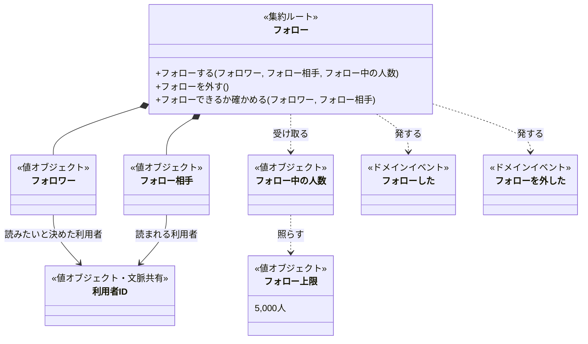
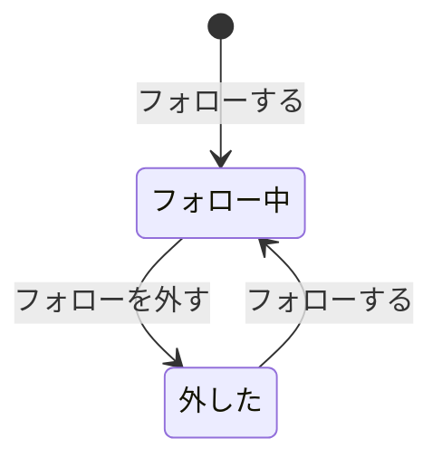

# フォローのドメインモデル

集約は「フォロー」一つである。一人のフォロワーが一人のフォロー相手を読みたいと決めたことを、フォローしてから外すまで一つのフォローとして扱う。フォロー上限は受け取ったフォロー中の人数でフォローが判断し、同じ二人の間の重複と同時に起きたときの決まりは、集約の外のフォローを記録する側に任せる（後者は仮置き。「未決」を参照）。

## クラス図

## フォローの境界は、二人の間の一件に引いた

境界は、一人のフォロワーと一人のフォロー相手の間の一件のフォローに引いた。フォローはフォローしたときに始まって外したときに終わり、外した後にもう一度フォローすれば前とは別の新しいフォローになる（業務知識の用語「フォロー」）。生成から終端までが一件で閉じているので、状態とフォロワー、フォロー相手を食い違わせないためなら一件分で足りる。フォロワーの全フォローを一つの集約にすれば、フォロー上限と重複を内側で守れる。しかしその場合、一件を外すだけのコマンドが最大5,000件のフォローを巻き込む。そこでフォロー上限は、フォローするときに呼び手が渡すフォロー中の人数で判断する。フォロー中の人数は「一つのフォローの中には無く、そのフォロワーのフォローをすべて見て初めて分かる」事実だからである（業務知識の概念「フォロー中の人数」）。

利用者は集約にしない。利用者の登録と、利用者と利用者IDという語はアカウントの業務が担い、この文脈は登録済みの利用者を所与として扱う。フォロワーもフォロー相手も、利用者IDで利用者を指す。

### 状態遷移

外したフォローは「外した」状態で残り、もう一度フォローすると同じフォローがフォロー中に戻る。

### 守ること

フォロワーとフォロー相手は別の利用者で、フォローの間は変わらない。

残りの決まりはフォロー一件の中では守れない。フォロー一件は、同じときに生まれる別のフォローを知らないからである。受け取るフォロー中の人数も、判断した瞬間の写しにすぎない。そこで、次の三つは follows テーブルの一意制約と SERIALIZABLE の分離レベルで保証する。一つ目は、同じフォロワーと同じフォロー相手の間にフォロー中のフォローが一つしかないこと（BDD-006、BDD-020）である。二つ目は、同時にフォローしてもフォロー中の人数がフォロー上限を超えないこと（BDD-021）、三つ目は、同じフォローを同時に二度外しても一回だけが成立すること（BDD-022）である。フォローの状態の変化と、そのとき発した「フォローした」「フォローを外した」の片方だけが残らず、成立した順に後から説明できることも、フォローを記録する側が保証する（仮置き、BDD-009）。

### フォローする

「フォローした」を発する。フォロワーとフォロー相手が同じ利用者なら「自分自身をフォローする」で拒む。フォロー中の人数がフォロー上限の5,000人に達していれば「フォロー上限に達している利用者がフォローする」で拒む。4,999人なら通り、5,000人目をフォローできる（BDD-001〜004）。

コマンドの外で拒むものもある。「利用者登録を終えていない人がフォローする」と「ほかの利用者としてフォローする」は、呼び手が本人と登録を確かめる段階で拒む（BDD-007、BDD-008）。「存在しない利用者をフォローする」は、呼び手がアカウントの業務の事実で確かめる段階で拒む（仮置き、BDD-005）。「すでにフォロー中の相手をフォローする」は、フォローを記録する側が拒む（仮置き、BDD-006）。外した相手をもう一度フォローしたときは、終わったフォローが戻るのではなく、新しいフォローが生まれる（BDD-009）。

### フォローを外す

フォローは終わり、「フォローを外した」を発する。フォロー上限に達していた利用者も、これでフォロー中の人数が一人減る（BDD-010、BDD-011）。

外すフォローが見つからないときは、コマンドを呼ぶ前に呼び手が「フォローしていない相手のフォローを外す」で拒む。本人がフォロワーになっているフォロー中のフォローを、その相手について探して無ければこの理由になる。自分自身、存在しない利用者、フォロー相手の側から外そうとした場合（BDD-014）も同じである（BDD-012）。「ほかの利用者としてフォローを外す」と「利用者登録を終えていない人がフォローを外す」は、呼び手が本人と登録を確かめる段階で拒む（BDD-013）。

### 取り違えやすいもの

フォロー中の人数は、自分をフォローしている利用者の数ではない。数えるのは、その利用者がフォロワーになっているフォロー中のフォローだけである。

「フォローしていない」はフォローの状態ではない。フォローする相手を探す一覧で、見ている利用者から見た区別であり、外したフォローもこの集約には残らない。「本人」も同じ一覧の区別であり、コマンドを呼べる人かどうかは呼び手が確かめる。

## 業務知識への提案

### フォローを見分ける語

同じフォロワーが同じ相手を外してからもう一度フォローすると、前とは別の新しいフォローが生まれる（用語「フォロー」、BDD-009）。フォロワーとフォロー相手の利用者IDだけでは、前後のフォローを見分けられない。「フォローを外す」の対象を指すにも、成立した順に説明するにも、フォローを見分ける語が要る。業務用語とユビキタス言語の表へ足し、英名は業務知識の側で決めてもらう。

## 未決

**同じ二人の間の重複の守り手（仮置き）。** follows テーブルの一意制約で守ると決めた。呼び手がその時点の事実を値にしてコマンドへ渡す案は、事実を表す語が業務知識に無いので採らなかった。業務知識がその語を持てば、渡す形へ移すかを見直す。

**フォロー相手の存在の確かめ手（仮置き）。** コマンドの前に呼び手がアカウントの業務の事実で確かめる形を仮に置いた。登録の決まりはアカウントの業務が持つからである。登録済みかを値にしてコマンドへ渡す案は、その語が無いので採らなかった。アカウントの業務知識の資料が置かれ、登録済みを表す語と渡し方が分かれば確定する。

**同時に起きたときの守り手と、成立した事実の一貫の守り手（仮置き）。** どちらもフォローを記録する側を仮に置いた。業務知識は結果（先に受け付けた一回だけが通る）を書くが、誰が保証するかは書いていない。境界をフォロワーの全フォローへ広げて内側で守る案は、一件を外すコマンドが全フォローを巻き込むので採らなかった。コマンドデータモデルで、記録する側がこれらを保証できるかが分かれば確定する。保証できなければ境界を見直す。

**外したフォローを状態として残すか。** 業務知識で仮置き（残さない）なので、それに従って終端へ向けた。残すと決まれば、状態遷移図に外した状態が加わる。そのとき、外したフォローが「フォローを外す」を受けたときの拒む理由が要る。

**利用者IDの英名。** 業務知識で未定で、アカウントの業務知識の資料もまだ無い。クラス図の識別子 `UserId` は仮に置いたもので、アカウントの業務知識が英名を決めたら差し替える。

**説明の相手と目的。** 業務知識で仮置きである。モデルの形は変えず、「成立した順に後から説明できる」を記録する側が保証するという守ることだけに及ぶ。
