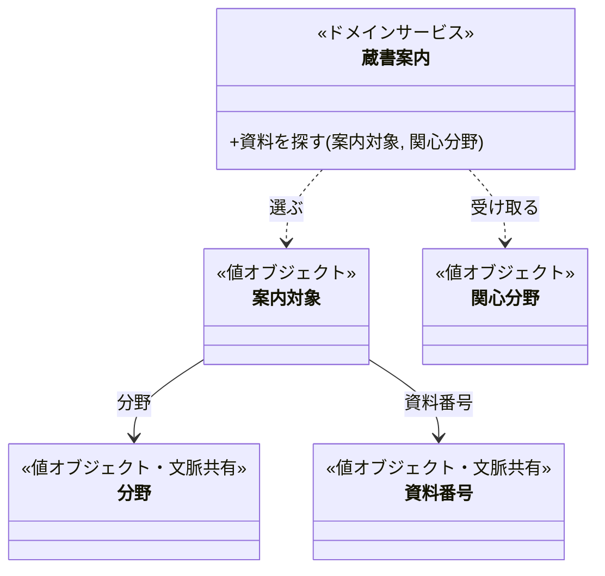

# 蔵書案内のドメインモデル

この業務は集約と状態遷移を持たず、資料を探すときの選択と順序を決める。

## 判断に使う値と結果

```mermaid
classDiagram
    class LibraryCatalog["蔵書案内"] {
        <<ドメインサービス>>
        +資料を探す(案内対象, 関心分野)
    }
    class CatalogCandidate["案内対象"] {
        <<値オブジェクト>>
    }
    class BookNumber["資料番号"] {
        <<値オブジェクト・文脈共有>>
    }
    class Subject["分野"] {
        <<値オブジェクト・文脈共有>>
    }
    class Interest["関心分野"] {
        <<値オブジェクト>>
    }
    LibraryCatalog ..> CatalogCandidate : 選ぶ
    LibraryCatalog ..> Interest : 受け取る
    CatalogCandidate --> Subject : 分野
    CatalogCandidate --> BookNumber : 資料番号
```

## 選択と順序

関心分野と同じ分野の資料だけを選ぶ（BDD-001）。選んだ資料は資料番号の小さい順に並べる（BDD-002）。
