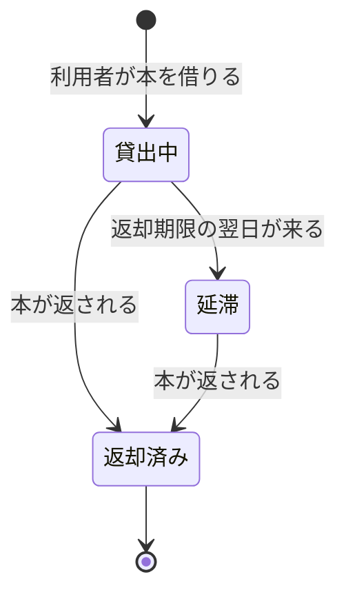

# 図書館の貸出の業務知識・コアドメイン

図書館の窓口担当と利用者が、本を貸してよいか、いつまでに返すか、いつ延滞になるかを同じ言葉で判断するための業務知識である。架空の題材によるdomain-rule型のfixtureで、貸出の成立、返却、延滞と、それを拒む理由を扱う。

# 概要

**図書館の貸出は、限られた蔵書を多くの利用者へ順に行き渡らせるために、一冊の本を一人の利用者へ期限付きで預ける業務である。** 利用者は本を借り、返却期限までに返す。一人が抱え込める冊数に上限を設け、返さないまま期限を過ぎた利用者には新しい本を貸さない。そうしなければ、本が一部の利用者の手元に留まり、ほかの利用者が借りられなくなるからである。

**この業務が担わないこと**: 利用者の登録と利用者カードの発行は利用者登録の業務が、本の受け入れと除籍は蔵書管理の業務が担う。この業務は、登録済みの利用者と所蔵している本を所与として扱う。延滞を利用者へ知らせる手段は、この業務の決まりではない。

# ユビキタス言語

## 業務用語

| 業務用語 | 意味 | 境界・判断に使う場面 |
|---|---|---|
| 利用者 | 図書館に登録し、利用者カードを持つ人 | 本を借りられるのは利用者だけである |
| 利用者番号 | 利用者カードに記された、利用者を一人に特定する番号 | 誰の貸出かを決める |
| 本 | 図書館が所蔵する一冊の本 | 同じ書名でも一冊ごとに別の本として扱う |
| 資料番号 | 本の一冊ごとに付いた番号 | どの一冊の貸出かを決める |
| 貸出 | 一人の利用者が一冊の本を借りてから返すまでの約束 | 一冊を一つの貸出として扱い、まとめて借りても冊数だけ貸出がある |
| 貸出日 | 本を借りた日 | 返却期限を決める起点になる |
| 返却期限 | 本を返す約束の日。貸出日の14日後 | この日を過ぎても返されなければ延滞になる |
| 貸出上限 | 一人の利用者が同時に借りていられる冊数の上限。5冊 | 新しく借りられるかを判断する |
| 貸出状況 | 一人の利用者がいま借りている冊数と、延滞している貸出があるか | 本を借りるときに、上限と延滞を判断する |
| 貸出中 | 本を借りていて、返却期限を過ぎていない貸出 | 返せる |
| 延滞 | 返却期限を過ぎても本が返されていない貸出 | 返せる。延滞の貸出を持つ利用者は新しく借りられない |
| 返却済み | 本が返された貸出 | それ以上変わらない |

## 業務イベント

| 業務イベント | 起きた事実 | 変わる判断・状態・責任 |
|---|---|---|
| 本が貸し出された | 利用者が一冊の本を借りた | 貸出中の貸出が生まれ、その本はほかの利用者へ貸せなくなる |
| 本が返却された | 貸出中か延滞の本が返された | 貸出は返却済みになり、本はほかの利用者へ貸せるようになる |
| 貸出が延滞になった | 返却期限を過ぎても本が返されていなかった | 貸出は延滞になり、その利用者は新しく借りられなくなる |

## コマンドとクエリ

| 業務上の行い | 種別 | 起こす業務イベント |
|---|---|---|
| 本を借りる | コマンド | 本が貸し出された |
| 本を返す | コマンド | 本が返却された |
| 延滞にする | コマンド | 貸出が延滞になった |
| 借りている本を確かめる | クエリ | なし |

# 概念

## 貸出

貸出は、一人の利用者と一冊の本の間の、返却期限付きの約束である。貸出日に始まり、本が返されると終わる。返却期限は貸出日から決まり、貸出の間は変わらない。返却期限を過ぎても返されない貸出は延滞になるが、延滞になっても本を返せば約束は終わる。

## 貸出状況

貸出状況は、一人の利用者が今どれだけ借りていて、返していない延滞があるかという、その時点の事実である。一つの貸出の中には無く、利用者の貸出をすべて見て初めて分かる。本を借りられるかは、この貸出状況で決まる。

# 常に守られること

| # | 常に守られること | 破れたときに業務が困ること |
|---|---|---|
| 1 | 一冊の本は、同時に一つの貸出中か延滞の貸出にしか属さない | 手元に無い本を貸したことになり、誰が持っているか分からなくなる |
| 2 | 一人の利用者の貸出中と延滞の貸出は、合わせて5冊を超えない | 一部の利用者が本を抱え込み、ほかの利用者が借りられなくなる |
| 3 | 返却期限は貸出日の14日後で、貸出の間変わらない | いつ延滞になるかを利用者と図書館が同じように判断できなくなる |
| 4 | 返却済みの貸出は変わらない | 終わった約束が蒸し返され、本の所在が分からなくなる |

# 状態と、その移り変わり

| 引き金（起きること） | 何が移るか |
|---|---|
| 利用者が本を借りる | 貸出が貸出中で始まる |
| 本が返される | 貸出中か延滞の貸出が返却済みになる |
| 返却期限の翌日が来る | 貸出中の貸出が延滞になる |

## 貸出

| 状態 | 説明 | 終端か |
|---|---|:---:|
| 貸出中 | 本を借りていて、返却期限を過ぎていない | いいえ |
| 延滞 | 返却期限を過ぎても本が返されていない | いいえ |
| 返却済み | 本が返された | はい |



# 誰が行えるか

| 業務上の行い | 種別 | 行える役割 | 行えない場合の業務上の理由 |
|---|---|---|---|
| 本を借りる | コマンド | 利用者本人 | 他人の利用者カードで借りると、借りた責任を負う人が分からなくなる |
| 本を返す | コマンド | 本を持ってきた人なら誰でも | なし（本が戻れば約束は果たされる） |
| 延滞にする | コマンド | 図書館（返却期限の翌日に行う） | 返却期限の当日までに延滞にすると、約束の期間内の利用者を貸出停止にしてしまう |
| 借りている本を確かめる | クエリ | 利用者本人 | 他人の借りている本は知らせない |

# 業務ルール

## 本を借りる

利用者は、貸出状況が次をすべて満たすときだけ本を借りられる。借りている冊数が貸出上限の5冊未満であること。延滞の貸出が一つも無いこと。借りようとする本が、ほかの貸出中か延滞の貸出に属していないこと。借りると、貸出日をその日、返却期限をその14日後とする貸出中の貸出が生まれる。

## 本を返す

貸出中か延滞の貸出の本だけを返せる。延滞していても返却は受け付ける。返すと貸出は返却済みになる。延滞の貸出を返し、ほかに延滞が無くなれば、その利用者はすぐに新しく借りられる。

## 延滞にする

返却期限の翌日になっても貸出中のままの貸出を、延滞にする。返却期限の当日はまだ延滞にしない。

# 導出されること

```
1. 返却期限 = 貸出日 + 14日
2. 借りている冊数 = その利用者の貸出中と延滞の貸出の数
```

# 同時に起きたとき

| 同時に起きること | 業務上どちらが通るか | その理由 |
|---|---|---|
| 同じ本を二人の利用者が借りる | 先に受け付けた一人だけ | 一冊の本は一つの貸出にしか属さない（#1） |
| 同じ利用者が5冊目と6冊目を同時に借りる | 先に受け付けた一冊だけ | 上限を超えて貸さない（#2） |
| 延滞にするのと本が返されるのが同じ貸出で重なる | 先に起きた方。返却が先なら延滞にしない | 返された本の貸出は変わらない（#4） |

# 拒むときの理由

| 拒まれる操作 | 拒まれる業務上の根拠 |
|---|---|
| 貸出上限に達している利用者が本を借りる | 常に守られること #2 |
| 延滞の貸出がある利用者が本を借りる | 業務ルール「本を借りる」 |
| 貸出中の本を借りる | 常に守られること #1 |
| 他人の利用者カードで本を借りる | 誰が行えるか |
| 返却済みの本を返す | 常に守られること #4 |
| 返却期限を過ぎていない貸出を延滞にする | 業務ルール「延滞にする」 |

# まだ決まっていないこと

- 貸出の延長を認めるか。認めるなら返却期限が変わるため、常に守られること #3 を見直す。

# BDD

ここまでの決まりが、具体の場面でどう働くかを示す。**ここに上で書いていない決まりを持ち込まない。**

## 本を借りる

| BDD | 主な事前状態 | 業務イベント | 業務結果 |
|---|---|---|---|
| BDD-001 | 借りている冊数0冊、延滞なし | 本を借りる | 貸出中の貸出が生まれる |
| BDD-002 | 借りている冊数4冊、延滞なし | 本を借りる | 5冊目の貸出が生まれる |
| BDD-003 | 借りている冊数5冊 | 本を借りる | 拒まれる |
| BDD-004 | 延滞の貸出が1冊 | 本を借りる | 拒まれる |
| BDD-005 | 本がほかの利用者に貸出中 | 本を借りる | 拒まれる |
| BDD-006 | 他人の利用者カード | 本を借りる | 拒まれる |

### [BDD-001] 延滞の無い利用者が本を借りると貸出中の貸出が生まれる

```gherkin
Given: 利用者番号 U-0001 の利用者は本を1冊も借りておらず、延滞の貸出も無い
  And: 資料番号 B-1001 の本はどの貸出にも属していない
When: 利用者 U-0001 が2026年10月1日に本 B-1001 を借りる
Then: 利用者 U-0001 と本 B-1001 の貸出が貸出中で生まれる
  And: 貸出日は2026年10月1日、返却期限は2026年10月15日である
```

### [BDD-002] 4冊借りている利用者は5冊目を借りられる

```gherkin
Given: 利用者 U-0001 は貸出中の本を4冊借りており、延滞の貸出は無い
  And: 本 B-1005 はどの貸出にも属していない
When: 利用者 U-0001 が2026年10月1日に本 B-1005 を借りる
Then: 本 B-1005 の貸出が貸出中で生まれ、利用者 U-0001 の借りている冊数は5冊になる
```

### [BDD-003] 5冊借りている利用者は6冊目を借りられない

```gherkin
Given: 利用者 U-0001 は貸出中の本を5冊借りており、延滞の貸出は無い
  And: 本 B-1006 はどの貸出にも属していない
When: 利用者 U-0001 が2026年10月1日に本 B-1006 を借りる
Then: 貸出は生まれない
  NOTE: Rule: 貸出上限に達している利用者が本を借りる
    Reason: 一人の利用者の貸出中と延滞の貸出は5冊を超えない
```

### [BDD-004] 延滞の貸出がある利用者は本を借りられない

```gherkin
Given: 利用者 U-0002 は延滞の貸出を1冊持ち、借りている冊数は1冊である
  And: 本 B-1007 はどの貸出にも属していない
When: 利用者 U-0002 が2026年10月20日に本 B-1007 を借りる
Then: 貸出は生まれない
  NOTE: Rule: 延滞の貸出がある利用者が本を借りる
    Reason: 返していない延滞がある利用者には新しい本を貸さない
```

### [BDD-005] ほかの利用者に貸出中の本は借りられない

```gherkin
Given: 本 B-1001 は利用者 U-0001 に貸出中である
  And: 利用者 U-0003 は本を1冊も借りておらず、延滞の貸出も無い
When: 利用者 U-0003 が2026年10月2日に本 B-1001 を借りる
Then: 貸出は生まれない
  NOTE: Rule: 貸出中の本を借りる
    Reason: 一冊の本は同時に一つの貸出にしか属さない
```

### [BDD-006] 他人の利用者カードでは本を借りられない

```gherkin
Given: 利用者 U-0003 が利用者 U-0001 の利用者カードを差し出している
  And: 本 B-1008 はどの貸出にも属していない
When: 利用者 U-0003 が利用者 U-0001 として本 B-1008 を借りる
Then: 貸出は生まれない
  NOTE: Rule: 他人の利用者カードで本を借りる
    Reason: 借りた責任を負う人が分からなくなる
```

## 本を返す

| BDD | 主な事前状態 | 業務イベント | 業務結果 |
|---|---|---|---|
| BDD-007 | 貸出中 | 本を返す | 返却済みになる |
| BDD-008 | 延滞 | 本を返す | 返却済みになり、すぐ借りられる |
| BDD-009 | 返却済み | 本を返す | 拒まれる |

### [BDD-007] 貸出中の本を返すと返却済みになる

```gherkin
Given: 本 B-1001 は利用者 U-0001 に貸出中で、返却期限は2026年10月15日である
When: 2026年10月10日に本 B-1001 が返される
Then: 貸出は返却済みになる
  And: 本 B-1001 はほかの利用者が借りられる
```

### [BDD-008] 延滞の本を返すと返却済みになり、すぐに借りられる

```gherkin
Given: 本 B-1002 は利用者 U-0002 の延滞の貸出で、利用者 U-0002 のほかの貸出に延滞は無い
When: 2026年10月20日に本 B-1002 が返される
Then: 貸出は返却済みになる
  And: 利用者 U-0002 は同じ日に新しく本を借りられる
```

### [BDD-009] 返却済みの貸出の本は返せない

```gherkin
Given: 本 B-1001 の利用者 U-0001 の貸出は返却済みである
When: 利用者 U-0001 の貸出として本 B-1001 が返される
Then: 貸出は返却済みのまま変わらない
  NOTE: Rule: 返却済みの本を返す
    Reason: 返却済みの貸出は変わらない
```

## 延滞にする

| BDD | 主な事前状態 | 業務イベント | 業務結果 |
|---|---|---|---|
| BDD-010 | 返却期限の翌日、貸出中 | 延滞にする | 延滞になる |
| BDD-011 | 返却期限の当日、貸出中 | 延滞にする | 拒まれる |
| BDD-012 | 返却期限の翌日、返却済み | 延滞にする | 拒まれる |

### [BDD-010] 返却期限の翌日に貸出中の貸出が延滞になる

```gherkin
Given: 本 B-1001 は利用者 U-0001 に貸出中で、返却期限は2026年10月15日である
When: 2026年10月16日に図書館が貸出を延滞にする
Then: 貸出は延滞になる
  And: 利用者 U-0001 は延滞の本を返すまで新しく借りられない
```

### [BDD-011] 返却期限の当日はまだ延滞にならない

```gherkin
Given: 本 B-1001 は利用者 U-0001 に貸出中で、返却期限は2026年10月15日である
When: 2026年10月15日に図書館が貸出を延滞にする
Then: 貸出は貸出中のまま変わらない
  NOTE: Rule: 返却期限を過ぎていない貸出を延滞にする
    Reason: 返却期限の当日までは約束の期間内である
```

### [BDD-012] 返却済みの貸出は延滞にならない

```gherkin
Given: 本 B-1001 の利用者 U-0001 の貸出は2026年10月15日に返却済みになった
When: 2026年10月16日に図書館が貸出を延滞にする
Then: 貸出は返却済みのまま変わらない
  NOTE: Rule: 返却済みの貸出は変わらない
    Reason: 延滞にするのと返却が重なったとき、返却が先なら延滞にしない
```

## 同時に起きたとき

| BDD | 主な事前状態 | 業務イベント | 業務結果 |
|---|---|---|---|
| BDD-013 | 本がどの貸出にも属さない | 二人が同時に本を借りる | 一人だけ借りられる |

### [BDD-013] 同じ本を二人が同時に借りると一人だけが借りられる

```gherkin
Given: 本 B-1009 はどの貸出にも属していない
  And: 利用者 U-0001 と利用者 U-0003 はどちらも借りている冊数が0冊で、延滞の貸出も無い
When: 利用者 U-0001 と利用者 U-0003 が2026年10月1日に同時に本 B-1009 を借りる
Then: 先に受け付けた一人の貸出だけが貸出中で生まれる
  And: もう一人は「貸出中の本を借りる」で拒まれる
```
