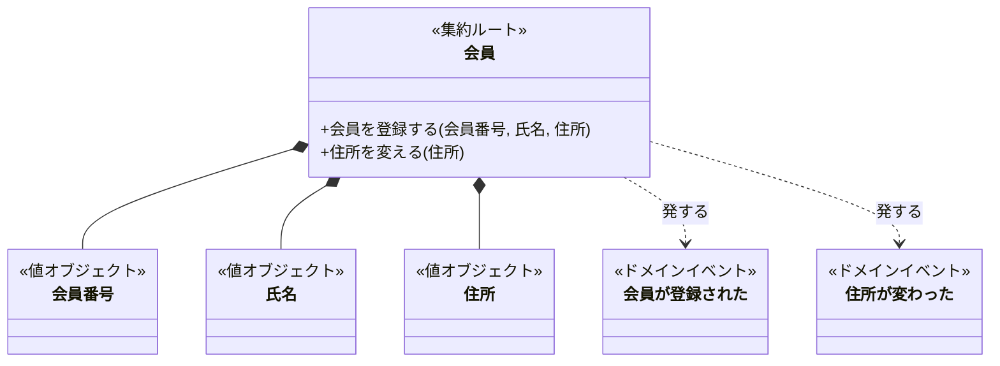

# 会員の住所録のドメインモデル

この文脈には、一つのコマンドで守る決まりがほとんど無い。会員は氏名と住所を持ち、住所の形が正しいことだけを確かめる。

## クラス図

```mermaid
classDiagram
    class Member["会員"] {
        <<集約ルート>>
        +会員を登録する(会員番号, 氏名, 住所)
        +住所を変える(住所)
    }
    class MemberNo["会員番号"] {
        <<値オブジェクト>>
    }
    class Name["氏名"] {
        <<値オブジェクト>>
    }
    class Address["住所"] {
        <<値オブジェクト>>
    }
    class Registered["会員が登録された"] {
        <<ドメインイベント>>
    }
    class Moved["住所が変わった"] {
        <<ドメインイベント>>
    }
    Member *-- MemberNo
    Member *-- Name
    Member *-- Address
    Member ..> Registered : 発する
    Member ..> Moved : 発する
```

## 未決

なし
